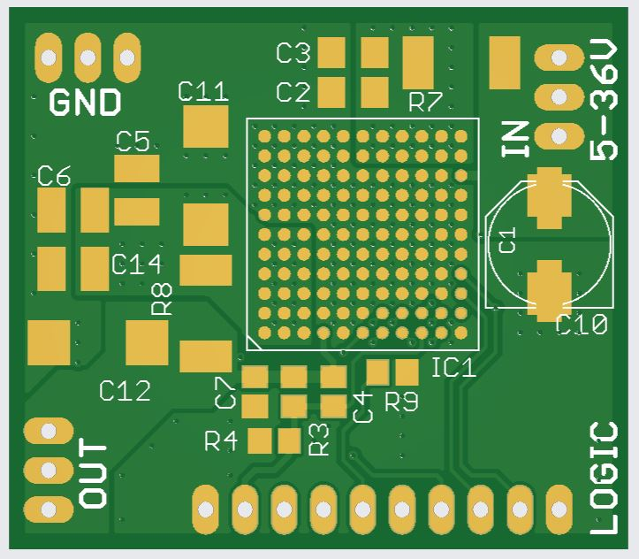
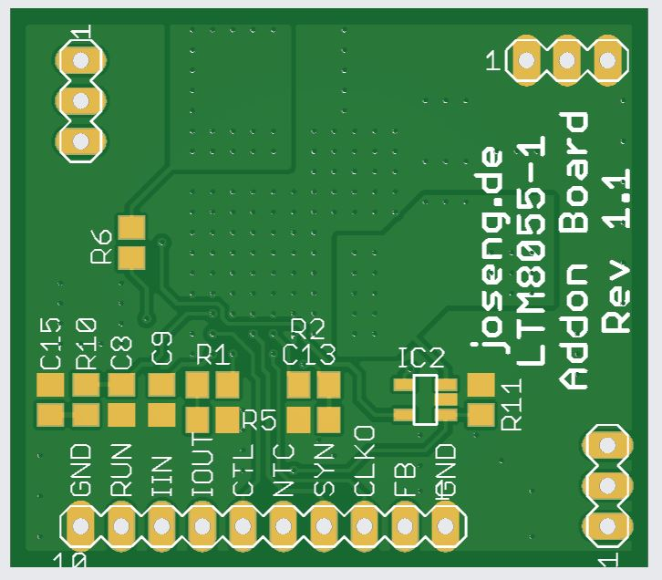

# LTM8055 Addon Board

This is a small 4 layer addon board with an [LTM8055(-1) DCDC regulator](https://www.analog.com/en/products/ltm8055.html), featuring an INA138 for output current measurement (as the internal current monitor output of the LTM8055 is not very accurate). Additionally a lot of the LTM8055 configuration pins are broken out to a header to be used on the base-board. But this small addon board can also be used as a standalone board, just fit the voltage feedback resistors on this board.

The LTM8055 is a 5-36V input, 8,5A Buck-Boost μModule Regulator with step-up and -down capability from 1,2V to 36V output.

Why use an addon board? This was developed, as the LTM8055 µModules are BGA parts, which are not the easiest parts for home use and soldering. This module can be very easily be soldered on a hotplate (I use the Miniware MHP30).

This board is for example used in the [joseng.de Lab-Box project](https://github.com/Wardstein/Lab-Box) in the multi-power-supply module. 

# License
The content of this whole repository is licensed under [CERN-OHL-W v2](License/cern_ohl_w_v2.txt) or later by Jonas Eberhard.
